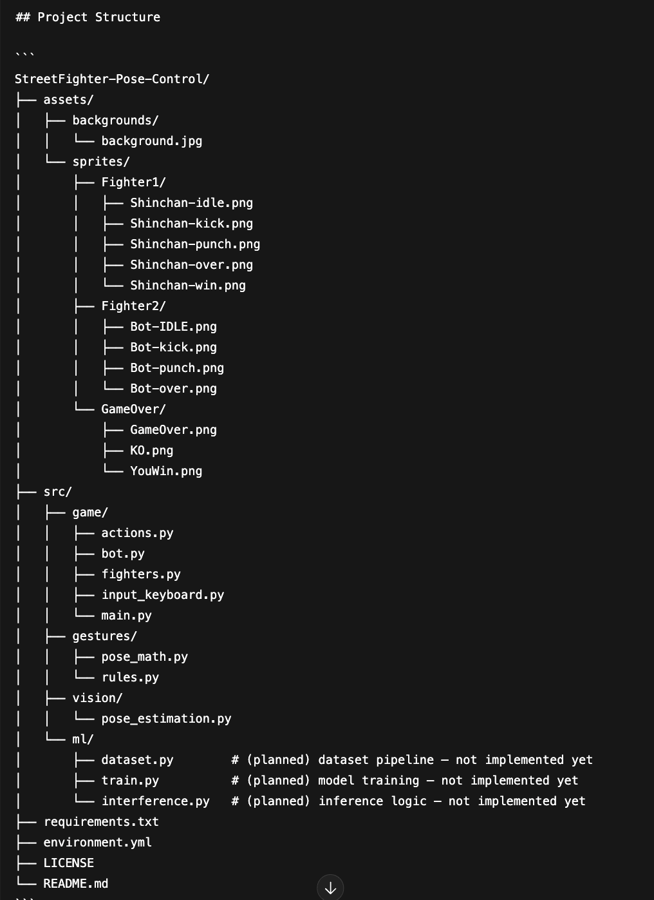

# 🥊 PlayFit-AI 🎮🧠  
*Pose-Controlled Fighting Game*

PlayFit-AI is a **pose-controlled fighting game prototype** inspired by classic Street Fighter–style gameplay. Using a webcam and real-time pose estimation, your **real body movements** (punches, kicks, idle stance) are translated directly into in-game actions.

Move your body. Fight the bot. Win the match. 💥

---

## ✨ Features

- Real-time webcam pose tracking  
- Body landmark extraction & geometry-based gesture detection  
- Punch, kick, jump & moving recognition using pose rules  
- AI-controlled opponent (bot)  
- Sprite-based animations & backgrounds  
- Keyboard fallback controls for testing  

---
## Project Structure (Visual)

  

---
## 🧪 Environment Setup

This project uses a Python virtual environment named:

### 🟢 `Streetfighter`

### Create the environment:
python -m venv Streetfighter

### Activate the environment

**macOS / Linux:**
source Streetfighter/bin/activate

**Windows:**
Streetfighter\Scripts\activate

---

## 📦 Dependencies

Main libraries used:

- numpy<2
- opencv-contrib-python==4.11.0.86
- mediapipe==0.10.21
- pygame 

Install everything with:
pip install -r requirements.txt

---

## ▶️ Run the Game

From the project root:

python -m src.game.main

If imports fail, try:
python src/game/main.py

Make sure your webcam is connected 📸

---

## 🕺 Controls

### 🧍 Pose Controls (Primary)
Gesture detection rules live here:
src/gestures/rules.py

This is where body poses are mapped to actions like:
- 👊 Punch
- 🦵 Kick
- 🧍 Idle
- 🤾🏻 Jump

You can tweak angles, distances, and thresholds to improve accuracy.

### ⌨️ Keyboard Controls (Fallback)
Keyboard input logic:
src/game/input_keyboard.py

Useful for debugging without a webcam.

---

## 🧠 How It Works

1. Webcam captures video frames  
2. Pose landmarks are extracted  
3. Angles & distances are computed  
4. Gesture rules classify movements  
5. Game loop applies actions & renders sprites  

---

## 🎨 Assets

All visuals live in the `assets/` folder:

- Backgrounds → `assets/backgrounds/`
- Fighters → `assets/sprites/Fighter1`, `Fighter2`
- End Screens → `assets/sprites/GameOver/`

If something doesn’t render, double-check your asset paths.

---

## 🧠 Machine Learning (Future Work)

The `ml/` folder is intentionally empty (for now 👀).

Planned ideas:
- Train an ML gesture classifier
- Personalized pose calibration
- Combo recognition using pose sequences

Currently, gestures are **rule-based**, not learned.

---

## 🚧 Roadmap

- More moves (block, combos)
- ML-based gesture recognition
- Calibration mode
- Smarter bot behavior
- Performance optimizations

---

## 📄 License

This project is licensed under the **MIT License** 📝  
You are free to use, modify, distribute, and build upon this project.

See the [`LICENSE`](LICENSE) file for full details.
---

## 👤 Author

**i-am-jillian**  
Computer Science & Engineering  
AI • Computer Vision • Human–Computer Interaction  

💪 Built for learning, experimentation, and fun.

